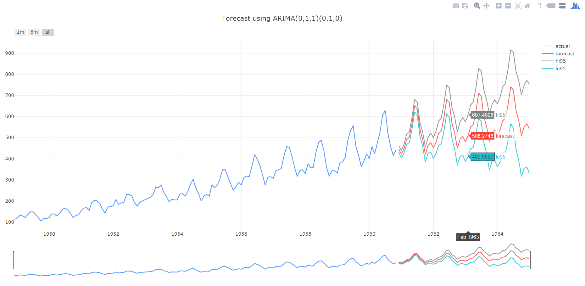
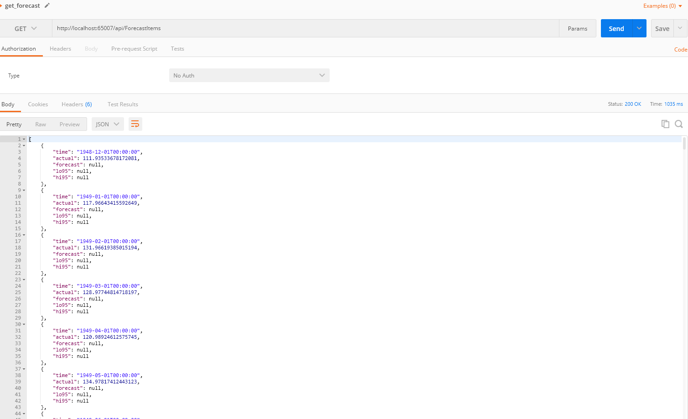
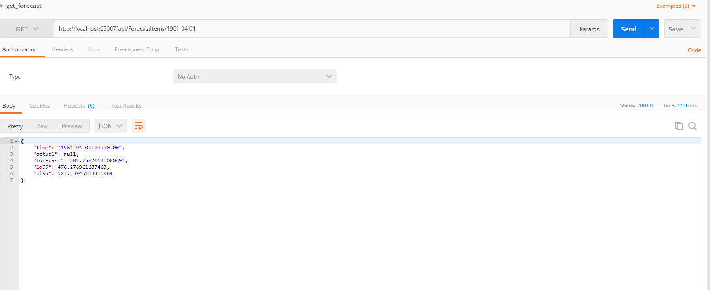

# Operationalizing Machine Learning using R and SQL Server

Tested on SQL Server 2017, Visual Studio 2017, .NET Core 2.0

## Solution

* R Project - forecasting 
* SQL Server - database definition
* RESTapi - API project
* Python - plotly

## Step by step
1) Deploy database using publish feature in Visual Studio 2017 to your localhost
2) Deploy stored procedure from R project to your SQL Server database 
3) Start IIS Express server (execute RESTapi project)
4) Use JSON result from within Python to generate plotly time series plot

## Result

### Plotly 

### REST API (postman)

